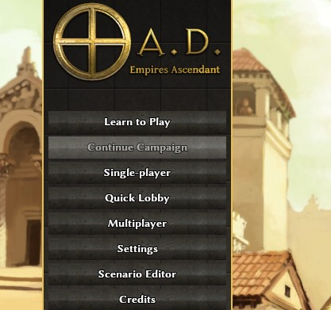

# quicklobby
Mod for the 0AD game to save you 1.7 seconds

# About Quick Lobby

*Quick Lobby* is a [0 A.D.](https://play0ad.com) mod aimed at saving you 1.47 seconds every time you want to enter the online lobby. The mod adds a button to the main menu that saves you clicking `Multiplayer` > `Game Lobby` > `Connect`. So one click instead of three. 

Saving an average of 1.47 seconds per use this mod could save you 8.94 minutes per year. Time freed up for more important things like talking about your favorite mods.

# Installation

Copy the contents of the `quicklobby` folder to your mods directry (e.g. `/home/jonny/.local/share/0ad/mods` on Linux)

# Prerequisites

This will only work if you have existing login credentials saved, so for any new install of 0AD you will first need to visit the menu through the normal `Multiplayer` route. 

# What it does

This is a simple mod that copies the existing `prelobby/login.js` `prelobby/login.xml` and `pregame/MainMenuItems.js` to this mod folder as `prelobby/quicklogin.js` `prelobby/quicklogin.xml`. The `MainMenuItems.js` gets a new button that calls the quicklogin code, which is itself a slightly amended login.js with 

